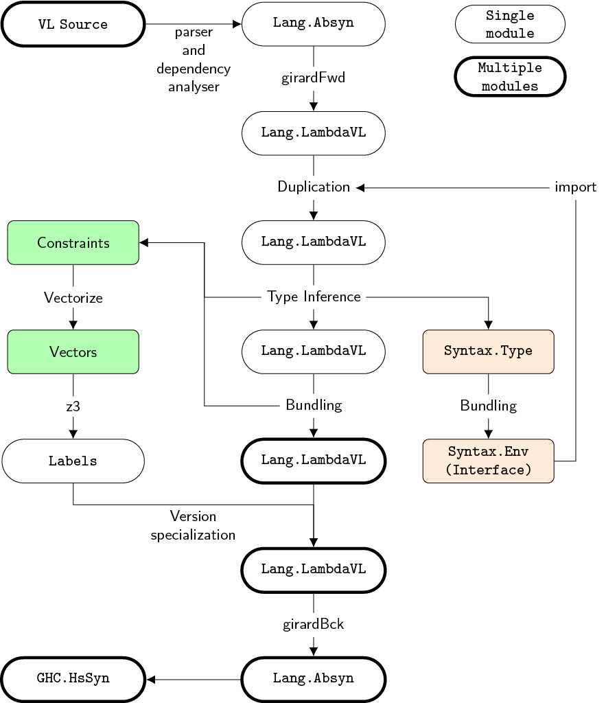

# VL
VL is a minimal functional language implemented as a preliminary experiment for the [Programming with Versions (PWV) project](https://prg.is.titech.ac.jp/projects/context-oriented-programming/version-programming/).
Within VL, developers have the flexibility to utilize multiple versions of a single module.
The VL surface language is designed as an extension of a Haskell subset with two syntax extensions for version-controlling terms, `version {M = V} of t` and `unversion t`.
VL ensures program safety under mixed versions by checking version consistency within a program.

**Disclaimer**:
1. VL is an *experimental language for research purposes* and does not even support common functional language features such as data types or type classes.
2. The present state of the implementation leaves much to be desired, and we have plans for a comprehensive refactoring in the foreseeable future.

## Technology behind VL
1. **Assigning versions to language elements**: *Expressions* is assigned a version. When bundling multiple version-specific interfaces, an initial version is assigned to each top-level symbol of the interface. These initial versions are automatically collected from outside the code (in VL, the subdirectory name serves as the version number).
2. **Collecting and utilizing the versions assigned to certain language elements**: *Expression-level dependency analysis* in VL's type-checking assigns an appropriate version to each expression. The VL compiler uses this version to compile the expression into a version-specific implementation.
3. **Ensuring safety when multiple versions coexist within the code**: *Version consistency* within the data flow ensures specification consistency. It's the programmer's responsibility to allow programs that are inconsistent in their versions, which can be achieved using the `unversion` expression.

For further details, please refer to the [paper list](#paper-list).

## Installation
The VL compiler is implemented in Haskell, and GHC 9.2.4 is required due to their dependencies.
Please install the necessary packages using the steps below.

```
# VL dependencies
VL
├── GHC 9.2.4
├── vl-haskell-src-exts (Parser)
├── vl-haskell-names (Name resolver)
└── z3 4.8.12 or later (Constraint solver)
```

### Install (on Ubuntu 22.04)
Install the packages necessary for building GHC (including libGMP, libtinfo, and gcc).
```bash
sudo apt update
sudo apt install libgmp-dev libtinfo-dev build-essential
```

Install GHC, stack, and cabal via [GHCup](https://www.haskell.org/ghcup/#).
```bash
curl --proto '=https' --tlsv1.2 -sSf https://get-ghcup.haskell.org | sh
source ~/.bashrc # enabling ghcup
```

Switch version of GHC on GHCup tui.
```bash
ghcup tui
# Move the cursor to the GHC tab on the GHCup GUI.
# Press 'a' to display past versions.
# Press 'i' to Install GHC version 9.2.4
✔✔ GHC 9.2.4
```

Install z3.
The VL compiler is likely compatible with z3 available in the apt repository.
```bash
sudo apt install z3
```
**Note**: Our initial studies used [z3](https://github.com/Z3Prover/z3/releases) version **4.12.2**.
If you're using a different version, you may observe variations in performance compared to the results presented in the paper.

## Run
The following command compiles a set of VL files (`*.hs`) with `examples/Main.hs` as the top-level module.
```bash
stack run "Main.hs"
```

Directories under `examples/*` are the targets for compilation.
Each module is expected to have a directory structure as follows:

```
examples/
├── Main.hs
├── M/
│   ├── 1.0.0/
│   │   └── M.hs
│   └── 1.0.1/
│       └── M.hs
├── N/
│   ├── 1.0.0/
│   │   └── N.hs
│   └── 2.0.0/
│       └── N.hs
...
```

Each module maintains `*.hs` files with the same module name in subdirectories labeled with version numbers.
The VL compiler scans and compiles all versions of modules required from the import declarations in `Main.hs`.
After type-checking all versions of each module, VL generates a version-agnostic interface for each module through an interface translation called _bundling_.
This allows upstream modules to access all versions of definitions of downstream modules.

**Limitations**:
1. The current VL requires homonymous symbols from different module versions to have the same type. If homonymous top-level symbols have different types, the compiler will output an error.
2. The `import` dependency of a version must not be reversed in different versions. Updates often modify dependent modules, but VL does not consider changes in the upstream-downstream direction of the module dependency graph. This is based on the assumption that before the compilation of a version of a module begins, it already has access to the version-agnostic interfaces of all versions of all modules it expects.
3. The type checking resolves constraints collected using z3, which takes a very long time. To verify this, please edit the settings at the top of `eval.sh` and run it by the following commands. The diagram in the paper is given by `triangle 10` at `nmodmax=5` and `nvermax=5`.

```bash
bash eval.sh      # run evaluation script and generate a log file
bash formatRes.sh # generate output.csv from a log file
python mkgraph.py # generate 3D-graph
```

## Pipeline


## Future Plans
1. **Application to further language elements**: We plan to assign versions to general top-level declarations in functional languages, including data type declarations. This extension will require a comprehensive extension of the core calculus, bundling, and code generation.
2. **Speedup constraint solver**: Currently, we use the z3 solver to solve version constraints collected from all modules. At least with the current method, the constraint resolution time is impractically slow. However, we are currently devising several methods to improve constraint resolution time, and some of these will significantly enhance constraint resolution.
3. **Version inference considering compatibility**: In the current VL, versions are merely identifiers and do not consider compatibility. For instance, the changes between versions 1.0.0 and 1.0.1 of a module might be minimal, with most symbols fully compatible. Yet, even if a programmer knows a "version that can be trusted to be compatible," there's no way to convey this to the VL type checker. However, we believe that we can improve the type checker to consider compatibility by using widely adopted versioning specifications like [semantic versioning](https://semver.org/).
4. **Version mismatch detection**: In principle, it is possible to identify the source code location causing version mismatches, just like type checking in general functional languages. This feature is not yet supported, but its implementation should not be too difficult.

## Paper List
| Paper                                                          | Description                                                             |
| :------------------------------------------------------------- | :---------------------------------------------------------------------- |
| [APLAS 2023](https://arxiv.org/abs/2310.00298)                 | Expression-level dependency analysis, bundling, compilation techniques. |
| [‹Programming› 2022](https://programming-journal.org/2022/6/5/) | $\lambda_{\textnormal{VL}}$, the underlying core calculus.              |
